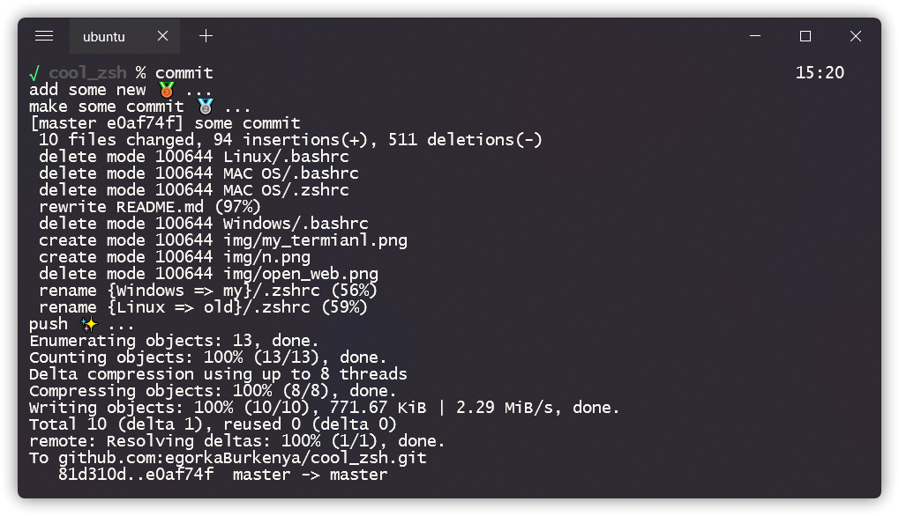
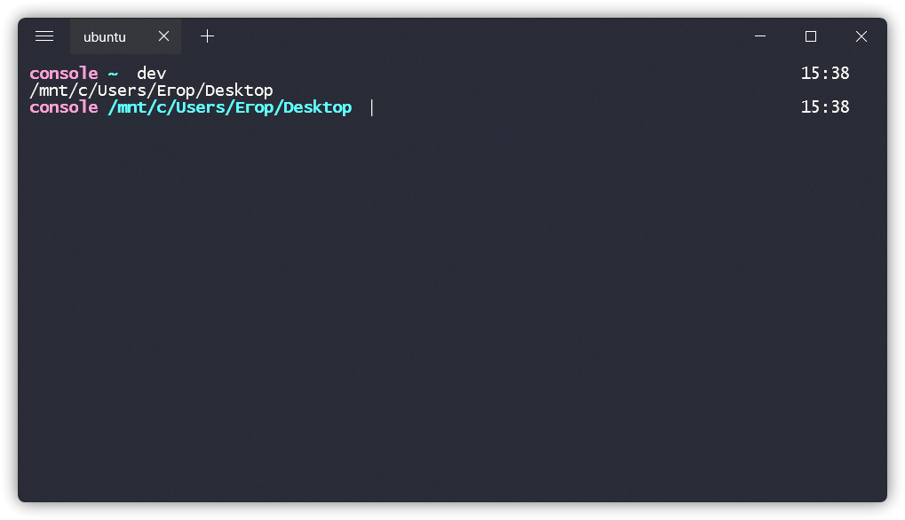

# Cool zsh
### Поговорим о том, как красиво настроить ваш терминал, сделать его более фунциональным и практичным ! 


Для начало не много подготовительной информации: 
* я буду настраивать оболочку `zsh` в WSL на Windows, но все настройки так же будут работать на Mac и Linux
* Если вы пользователь Windows для начала вам нужно установить [WSL](https://docs.microsoft.com/ru-ru/windows/wsl/install-win10)
* я использую терминал [Fluent Terminal](https://github.com/felixse/FluentTerminal) с темой [dracula](https://github.com/dracula/fluent-terminal)

*** 
Как только все готово ! у вас открыт ваш и без того красивый терминал, мы можем начинать:

Для начала нужно установить `zsh`:
```bash
sudo apt install zsh
```
Далее настройте его таким оброзом, что бы при запуске терминала у вас поумолчанию открывался zsh

Отлично ! теперь все что вам осталось, в корне вашей системы найти файл `.zshrc`(настроки вашего терминала) и скопировать туда, один из приложенных мной файлов (для вашей системы):
* [old/.zshrc]()
* [my/.zshrc]()
***
## Теперь поговорим про функционал и о том, как самому настраивать `zsh`:
# Функционал

Кратко расмотрим то, что теперь умеет наш терминал: 

Открытие сайтов и приложений:
```bash
alias github='echo "opening GitHub..."; xdg-open https://github.com/ 2>/dev/null'

alias telegram='echo "opening Telegram..."; cd /mnt/c/Users/'Your Windows User'/programs; xdg-open Telegram.lnk 2>/dev/null'
```
> Для полноценной работы открытия приложений вам нужно проделать некоторые манипуляции:
* Создать в корне вашей системы папку `programs` - назвать вы можете как угодно
* поместить туда ярлыки всех нужных вам приложений 
* и изминить путь до ярлыка в файле `.zshrc` 
Похожие действия вам нужно будет проделать и с другими коммандами

Полный список программ\сайтов вы можете посмотреть непосредственно в `.zshrc` файле

более краткий вызов языков и менеджера пакетов `pip3`
```bash
alias py='python3'
alias pip='pip3'
alias n='node'
```


Быстрый коммит на GitHub:
```bash
alias commit='echo "add some new 🥉 ..."; 
              git add .; 
              echo "make some commit 🥈 ..."; 
              git commit -m "some commit"; 
              echo "push ✨ ..."; 
              git push'
```


Быстрая навигация:
```bash
alias dev='cd /mnt/c/Users/'Your Windows/Linux User'/Desktop; pwd'
```
> Так же как и с открытием программ, замените путь на нужный вам


Открытие файла `.zshrc` и его перезапуск:
```bash
alias restart='source /home/'Your Linux User'/.zshrc'
alias settings='vim /home/'Your Linux User'/.zshrc'
```

Патерн на создание web приложения:
```bash
alias web='touch index.html; 
           touch main.js; 
           touch style.css; 
           echo "new web files created! "' 
```

# Внешний вид

Как вы могли заметить, я приложил два файла для каждой системы
* `old/.zshrc` - старый внешний вид
* `my/.zshrc` - тот который я использую сейчас 

В чем же их отличие ? Отличие лишь в двух последних строчах, которые меняют внешний вид оболочки:
 Вы можете посмотреть и выбрать то, что вам больше понравится ! 

# old 
```bash
# style
PROMPT="%B%F{13}console%f%b %B%F{87}%~%f%b%B%F{87}  %f%b"
RPROMPT="%T"
```
`RPROMPT="%T"` - выводит время с левой стороны 



# my 
```bash
# style
PROMPT='%(?.%F{green}√.%F{red}?%?)%f %B%F{240}%1~%f%b %# ' 
RPROMPT="%T"
```
`RPROMPT="%T"` - выводит время с левой стороны 


# Свои настройки

Теперь немного о том, как добовлять свои настройки:

Если вы хотите добавить открытие своего сайта, вам нужно написать в `.zshrc` следующее:
```bash
alias Команда_для_открытия='echo "'Сообщения при открытии'"; xdg-open 'Ссылка на ваш сайт''
```
Все нужно указывать без кавычек !
> если вы, как и я пользуетесь WSL то в конце вам нужно добваить 2>/dev/null
```bash
alias Команда_для_открытия='echo "'Сообщения при открытии'"; xdg-open 'Ссылка на ваш сайт' 2>/dev/null'
```
Это нужно для того, что бы терминал не кидал ошибок !
