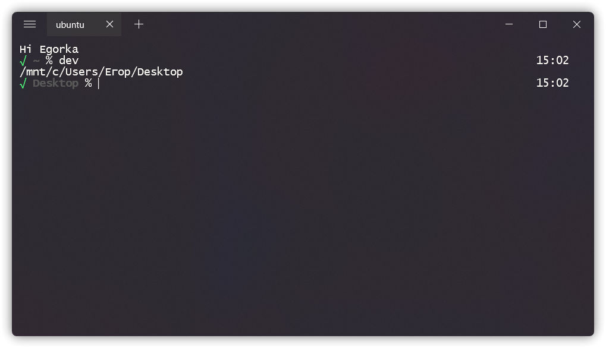
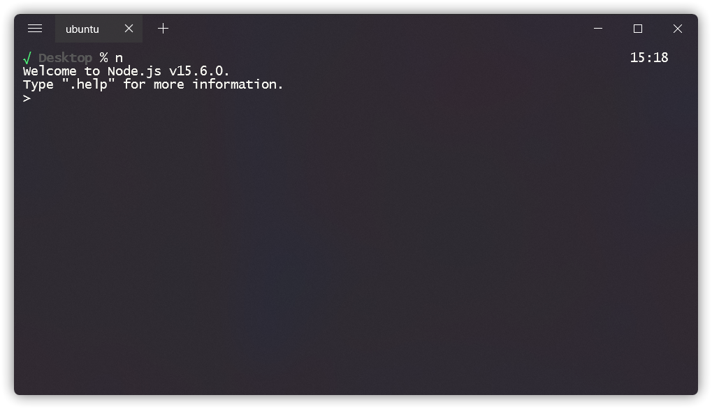

# Cool zsh
### Поговорим о том, как красиво настроить ваш терминал, сделать его более фунциональным и практичным ! 



Для начало не много подготовительной информации: 
* я буду настраивать оболочку `zsh` в WSL на Windows, но все настройки так же будут работать на Mac и Linux
* Если вы пользователь Windows для начала вам нужно установить [WSL](https://docs.microsoft.com/ru-ru/windows/wsl/install-win10)
* я использую терминал [Fluent Terminal](https://github.com/felixse/FluentTerminal) с темой [dracula](https://github.com/dracula/fluent-terminal)

*** 
Как только все готово ! у вас открыт ваш и без того красивый терминал, мы можем начинать:

Для начала нужно установить `zsh`:
```bash
sudo apt install zsh
```
Далее настройте его таким оброзом, что бы при запуске терминала у вас поумолчанию открывался zsh

Отлично ! теперь все что вам осталось, в корне вашей системы найти файл `.zshrc`(настроки вашего терминала) и скопировать туда, один из приложенных мной файлов:
* [old/.zshrc]()
* [my/.zshrc]()
***
## Теперь поговорим про функционал и о том, как самому настраивать `zsh`:
# Функционал

Кратко расмотрим то, что теперь умеет наш терминал: 

более краткий вызов языков и менеджера пакетов `pip3`
```bash
alias py='python3'
alias pip='pip3'
alias n='node'
```


Быстрый коммит на GitHub:
```bash
alias commit='echo "add some new 🥉 ..."; 
              git add .; 
              echo "make some commit 🥈 ..."; 
              git commit -m "some commit"; 
              echo "push ✨ ..."; 
              git push'
```


