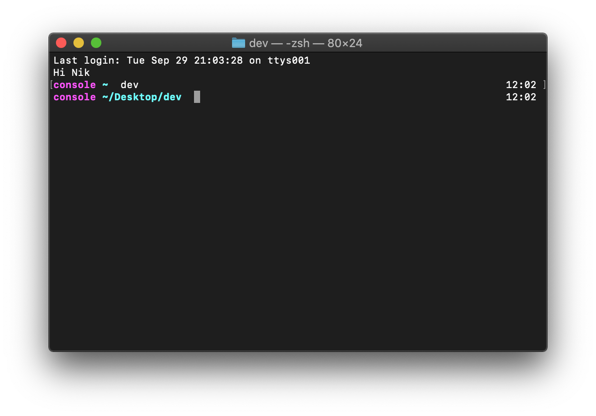

# Красивый zsh v2

# New:
* fixed error message when your open web app
* delete *open* command



# commands: 

* 

# install
First you need to install **zsh** itself

if you use the linux distribution ubuntu or under the linux system on windows, then you need to use the following command:

~~~bash
sudo apt install zsh
~~~

### zsh installed !

* but by default, you will continue to run the usual bash

* in MAC OS and Linux, you can write the command:
~~~bash
chsh -s /bin/zsh
~~~

* but in the Linux subsystem on Windows, this command does not always work, so in the folders for each OS there is a file **. bashrc** replace or copy the contents of **.bashrc** for your system

You can edit **.bashrc**: write in the first line of zsh by opening the file in any code editor

### Open .bachrc in nano:
~~~bash
cd ~
nano .bashrc
~~~

This is necessary so that when Bash starts zsh is immediately called

but if you are too lazy you can replace the file with the one i put in each folder

```
⛄After all this, to get such a beautiful and functional zsh, you need to replace the file **.zshrc** with the file I attached (or copy the contents)
```

